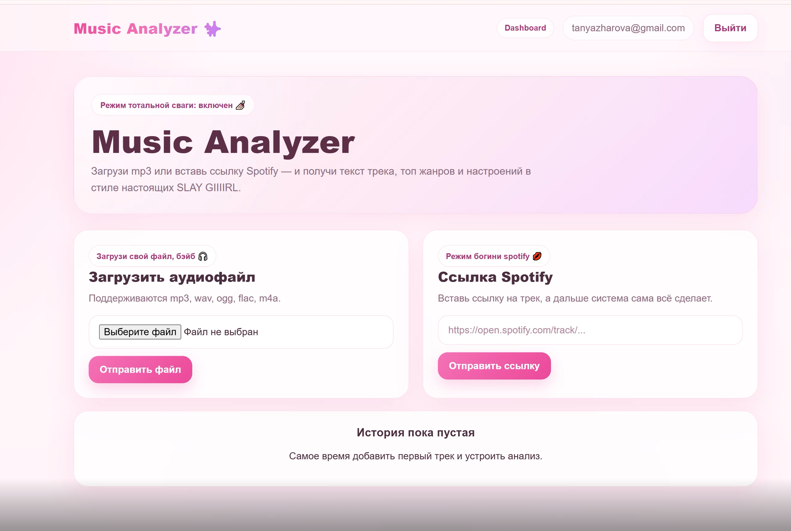
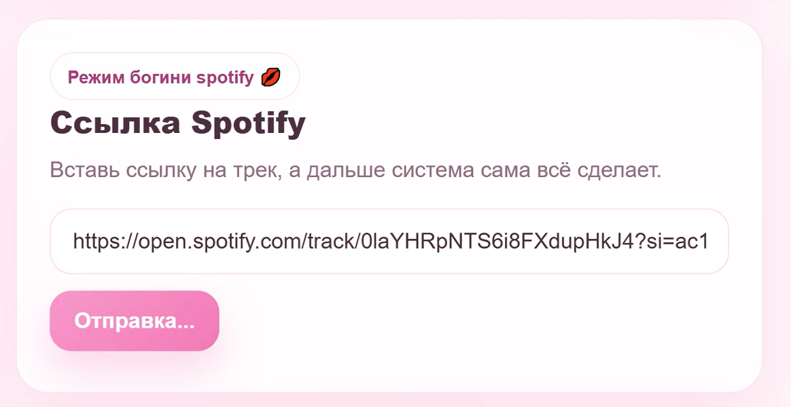
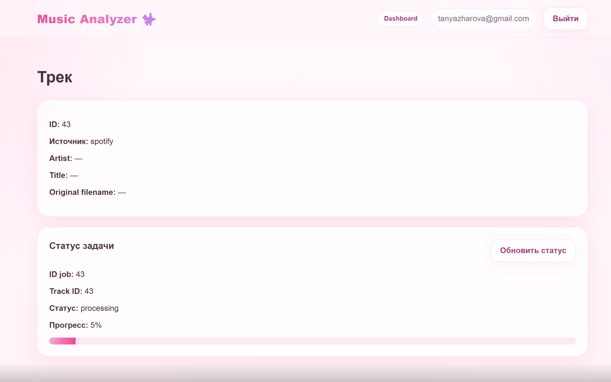
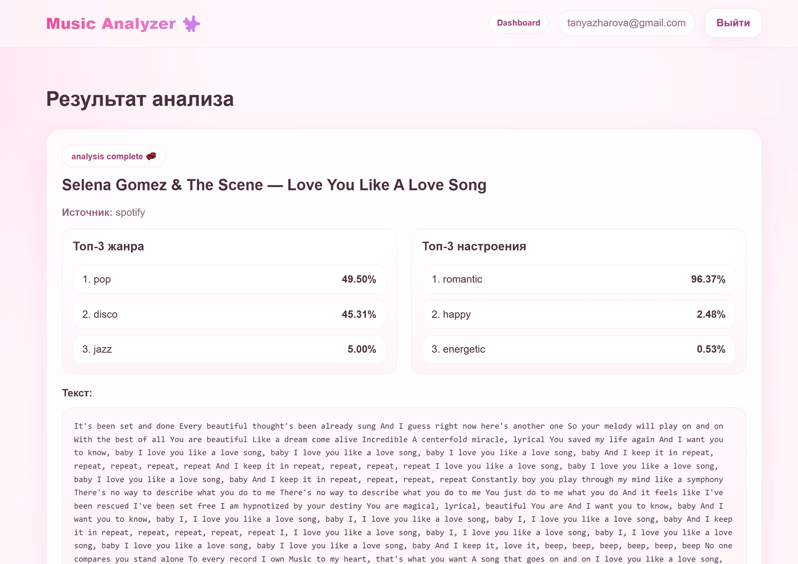
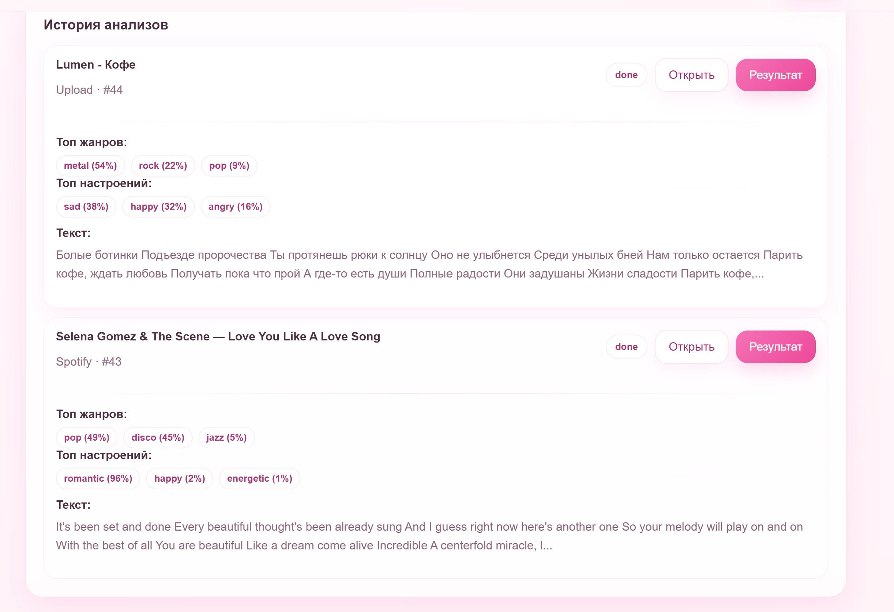
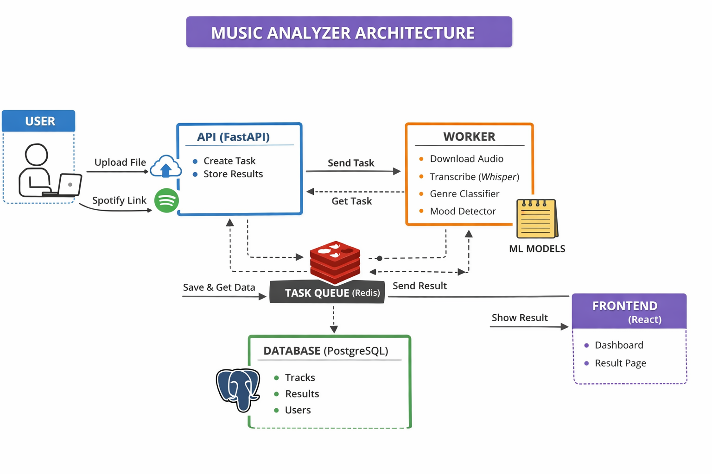

# Music Analyzer

Веб-сервис для анализа музыкальных треков: определение текста песни, жанра и настроения.

---

## Описание проекта

Сервис позволяет:

- загрузить аудиофайл (mp3, wav и др.)
- или вставить ссылку на Spotify трек
- автоматически:
  - скачать аудио
  - распознать текст песни
  - определить жанр (топ-3)
  - определить настроение (топ-3)

Результаты сохраняются и доступны в истории.

---

## Архитектура

Проект построен по микросервисной архитектуре:

- **API (FastAPI)** — обработка запросов
- **Worker** — выполнение ML-задач
- **Frontend (React)** — пользовательский интерфейс
- **PostgreSQL** — база данных
- **Redis** — очередь задач
- **Docker Compose** — оркестрация

---

## Технологии

### Backend

- FastAPI
- SQLAlchemy
- Alembic
- PostgreSQL
- Redis

### Machine Learning

- Transformers (Hugging Face)
- Whisper — распознавание речи
- Wav2Vec2 — определение жанра
- Text Classification — определение настроения

### Frontend

- React
- TypeScript
- CSS (custom UI)

### DevOps

- Docker
- Docker Compose

---

## Как работает система

1. Пользователь загружает файл или ссылку Spotify  
2. Backend создаёт задачу  
3. Worker:
   - скачивает аудио
   - разбивает на чанки
   - делает транскрипцию (Whisper)
   - определяет жанр
   - определяет настроение  
4. Результаты сохраняются в БД  
5. Frontend отображает результат  

---

## Установка и запуск

### 1. Клонировать репозиторий

```bash
git clone https://github.com/TaniaZharova2205/FQW_HSE.git
cd FQW_HSE
```

### 2. Создать .env

```env
PROJECT_NAME=Music Analyzer API
API_V1_STR=/api/v1

POSTGRES_SERVER=postgres
POSTGRES_PORT=5432
POSTGRES_DB=music_analyzer
POSTGRES_USER=music_user
POSTGRES_PASSWORD=music_password

REDIS_HOST=redis
REDIS_PORT=6379

SECRET_KEY=
ACCESS_TOKEN_EXPIRE_MINUTES=60
ALGORITHM=HS256

SPOTIFY_CLIENT_ID=
SPOTIFY_CLIENT_SECRET=
FFMPEG_PATH=
YT_COOKIES_FILE=/code/cookies.txt
AUDIO_DOWNLOAD_DIR=/code/storage/music

HUGGING_FACE_TOKEN=

GENRE_MODEL_PATH=/code/models/m3hrdadfi-wav2vec
MOOD_MODEL_PATH=/code/models/mood_model
YT_COOKIES_FILE=/code/cookies.txt
```

### 3. Запустить проект

```bash
docker compose up --build

docker compose exec api alembic upgrade head
```

---

## Основные шаги в интерфейсе

### Регистрация


### Интерфейс



### Ввод ссылки Spotify на трек



### Загрузка трека



### Получение результатов



### История анализа



---

## Модели

При первом запуске автоматически:

скачиваются модели
сохраняются в папку models/

Повторно не загружаются.

---

## Доступ

- Frontend: <http://localhost:3000>
- API: <http://localhost:8000>
- Swagger: <http://localhost:8000/docs>

---

## Основные возможности

- регистрация и авторизация
- загрузка аудио
- работа со Spotify ссылками
- история анализов
- отображение:
  - текста
  - жанров
  - настроения

---

## Ограничения

Скачивание через YouTube может зависеть от сети
требуется стабильное интернет-соединение для первой загрузки моделей, большие модели могут занимать много памяти, а также для SpotiFy и YouTube потребуется VPN.

---

## Структура проекта

```text
app/                         # Backend (FastAPI)
  api/                       # HTTP-роуты (эндпоинты API)
  core/                      # конфигурация, настройки, security (JWT и т.д.)
  db/                        # модели БД, сессии, подключение к PostgreSQL
  schemas/                   # Pydantic-схемы (валидация и ответы API)
  services/                  # бизнес-логика (ML, скачивание, анализ)
  utils/                     # вспомогательные функции
  workers/                   # асинхронные воркеры (обработка задач)
  main.py                    # точка входа FastAPI приложения

frontend/                    # Frontend (React + Vite)
  src/
    api/                     # функции для работы с backend API
    components/              # переиспользуемые UI-компоненты
    context/                 # глобальные состояния (auth, toast и т.д.)
    pages/                   # страницы приложения (dashboard, login и т.д.)
    types/                   # TypeScript типы
    utils/                   # вспомогательные функции
    App.tsx                  # основной компонент приложения
    main.tsx                 # точка входа React
    styles.css               # глобальные стили (UI)
    vite-env.d.ts            # типы окружения Vite
  .env                       # переменные окружения фронта
  DockerFile                 # сборка frontend контейнера
  index.html                 # HTML шаблон
  nginx.conf                 # конфигурация nginx (для продакшена)
  package.json               # зависимости и скрипты
  tsconfig.json              # настройки TypeScript
  vite.config.ts             # конфигурация сборщика Vite

models/                      # локально скачанные ML модели 
storage/                     # загруженные аудиофайлы
scripts/                     # скрипты (bootstrap моделей, ожидание сервисов)

.env                         # переменные окружения backend
alembic.ini                  # конфигурация миграций Alembic
cookies.txt                  # cookies для yt-dlp 
docker-compose.yml           # оркестрация всех сервисов
DockerFile                   # сборка backend/worker контейнера
requirements.txt             # зависимости Python
```

---

## Архитектура



---

## Особенности

асинхронная обработка задач через Redis
разделение API и ML-логики
локальное хранение моделей
контейнеризация всего приложения
